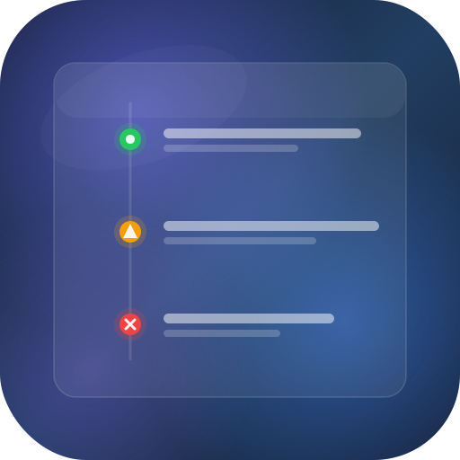

#  Mattermost Timeline

[](https://github.com/icoretech/mattermost-timeline/actions/workflows/ci.yml)
[](https://github.com/icoretech/mattermost-timeline/actions/workflows/release.yml)
[](https://github.com/icoretech/mattermost-timeline/releases/latest)
[](LICENSE)

A Mattermost plugin that displays a real-time animated timeline of events from external webhooks in the right-hand sidebar.

External services push events via HTTP webhooks. New entries animate into the timeline with support for Markdown messages, event types, source badges, and clickable links.

<p align="center">
  
  &nbsp;&nbsp;
  
</p>

## Features

- Real-time timeline in the Mattermost RHS (right-hand sidebar)
- Smooth slide-in animations for new events, flash highlight on updates
- Markdown support in event messages (bold, italic, code, links)
- Multiple labeled links per event, rendered as inline pills
- Event deduplication via `external_id` with incremental link aggregation
- Configurable timeline order (newest first or oldest first)
- Event type icons (deploy, alert, error, host_online, host_offline, etc.)
- Team-scoped events with per-team KV store persistence
- Paginated event history with "Load older events" support
- Channel-scoped timelines — events can target specific channels
- Icon-based reactions with avatar display (eyes, wrench, check, megaphone, thumbs-up, hand, party, heart)
- Webhook authentication via shared secret

## Requirements

- Mattermost Server 7.0+
- Go 1.26+ (for building the server)
- Node.js 24+ (for building the webapp)

## Installation

Download the latest release from the [Releases](https://github.com/icoretech/mattermost-timeline/releases) page and upload the `.tar.gz` file through **System Console > Plugin Management**.

### Signature Verification

Releases include a detached GPG signature (`.tar.gz.sig`). To verify:

```bash
# Import the public key
curl -sL https://raw.githubusercontent.com/icoretech/mattermost-timeline/main/assets/signing-key.asc | gpg --import

# Verify the bundle
gpg --verify ch.icorete.mattermost-timeline-*.tar.gz.sig ch.icorete.mattermost-timeline-*.tar.gz
```

To add the key to your Mattermost server for automatic verification:

```bash
mmctl plugin add key assets/signing-key.asc
```

## Configuration

After enabling the plugin, configure it in **System Console > Plugins > Mattermost Timeline**:

| Setting | Description | Default |
|---------|-------------|---------|
| Webhook Secret | Shared secret for authenticating incoming webhooks | _(empty)_ |
| Max Events Stored | Maximum events to persist per team | 500 |
| Max Events Displayed | Maximum events shown in the timeline | 100 |
| Timeline Order | Display order: "Oldest first" (newest at bottom) or "Newest first" (newest at top) | Oldest first |
| Enable Reactions | Allow users to react to timeline events with icon-based reactions | `true` |

## Webhook API

Send events to the plugin via HTTP POST:

```bash
curl -X POST https://your-mattermost.example.com/plugins/ch.icorete.mattermost-timeline/webhook?team_id=TEAM_ID \
  -H "Content-Type: application/json" \
  -H "X-Webhook-Secret: YOUR_SECRET" \
  -d '{
    "title": "web-server-01 online",
    "message": "Recovered after **5 minutes** of downtime",
    "links": [
      {"url": "https://monitor.example.com/hosts/01", "label": "Monitor"},
      {"url": "https://grafana.example.com/d/uptime", "label": "Dashboard"}
    ],
    "event_type": "host_online",
    "source": "monitoring"
  }'
```

#### Channel-Scoped Event

```bash
curl -X POST https://your-mattermost.example.com/plugins/ch.icorete.mattermost-timeline/webhook?team_id=TEAM_ID \
  -H "Content-Type: application/json" \
  -H "X-Webhook-Secret: YOUR_SECRET" \
  -d '{
    "title": "Deployed v3.0.0 to staging",
    "message": "All tests passed. Ready for review.",
    "event_type": "deploy",
    "source": "ci/cd",
    "channels": ["CHANNEL_ID_1", "CHANNEL_ID_2"]
  }'
```

### Webhook Payload

| Field | Type | Required | Description |
|-------|------|----------|-------------|
| `title` | string | yes | Event title |
| `message` | string | no | Event description (supports Markdown) |
| `link` | string | no | Single URL (legacy, prefer `links`) |
| `links` | array | no | Array of `{url, label?}` objects displayed as inline pills |
| `event_type` | string | no | One of: `host_online`, `host_offline`, `deploy`, `alert`, `error`, `info`, `success`, `money_in`, `money_out`, `security`, `incident`, `user_joined`, `user_left`, `scheduled`, `review`, `message`, `generic` |
| `source` | string | no | Source system label (e.g., "monitoring", "ci/cd") |
| `external_id` | string | no | Idempotency key. Subsequent webhooks with the same `external_id` update the existing event (fields are replaced, links are aggregated) |
| `team_id` | string | no | Team ID (can also be passed as `?team_id=` query param) |
| `channels` | array | no | Array of channel IDs (max 10). When set, the event appears only in those channels' timelines. Without this field, events are team-wide. |

## Development

### Prerequisites

- Go 1.26+
- Node.js 24+
- Make

### Build

```bash
# Full build (server + webapp + bundle)
make dist

# Server only
make server

# Webapp only
cd webapp && npm run build
```

### Test

```bash
# All tests
make test

# Server tests
cd server && go test ./...

# Webapp tests
cd webapp && npm test
```

### Lint

```bash
# Local fix mode: runs Biome write mode + TypeScript type checking
cd webapp && npm run lint

# CI-safe checks
cd webapp && npm run biome:ci
cd webapp && npm run typecheck
```

### Deploy to a Mattermost instance

```bash
make deploy
```

`make deploy` builds the plugin bundle, uploads it to Mattermost, and enables it.
The command uses the Mattermost plugin helper in `build/pluginctl`.

For a local development server with Mattermost local mode enabled, the helper uses
the local mode Unix socket automatically. Override the socket path when needed:

```bash
export MM_LOCALSOCKETPATH=/path/to/mattermost_local.socket
make deploy
```

For a remote server or any environment without local mode, authenticate over the
Mattermost REST API:

```bash
export MM_SERVICESETTINGS_SITEURL=https://mattermost.example.com
export MM_ADMIN_TOKEN='personal-access-token'
make deploy
```

`MM_ADMIN_TOKEN` must be the personal access token value, not the token ID shown
later in the Mattermost UI. Mattermost only shows the token value once when it is
created. If the value was not saved, revoke the old token and create a new one.

Username/password authentication is also supported:

```bash
export MM_SERVICESETTINGS_SITEURL=https://mattermost.example.com
export MM_ADMIN_USERNAME='admin@example.com'
export MM_ADMIN_PASSWORD='password'
make deploy
```

The target server must allow plugin uploads. The generated bundle is written to
`dist/ch.icorete.mattermost-timeline-<version>.tar.gz`, and the deploy step uses
the plugin ID `ch.icorete.mattermost-timeline`.

### Verify a deployment

Check that Mattermost sees the plugin as active:

```bash
curl -sS \
  -H "Authorization: Bearer $MM_ADMIN_TOKEN" \
  "$MM_SERVICESETTINGS_SITEURL/api/v4/plugins" |
  jq '.active[] | select(.id == "ch.icorete.mattermost-timeline") | {id, name, version}'
```

Then send a small webhook event and read it back through the plugin API. Keep the
webhook secret in your password manager or deployment secret store; Mattermost
redacts secret plugin settings in API responses, so do not rely on the config API
to recover it later.

```bash
export TEAM_ID='team-id'
export CHANNEL_ID='' # optional; set for a channel-scoped event
export WEBHOOK_SECRET='configured-webhook-secret'
export EXTERNAL_ID="timeline-smoke-$(date -u +%Y%m%dT%H%M%SZ)"

jq -n \
  --arg external_id "$EXTERNAL_ID" \
  --arg channel_id "$CHANNEL_ID" \
  '{
    title: "Timeline smoke test",
    message: "Deployment smoke test.",
    event_type: "info",
    source: "smoke-test",
    external_id: $external_id,
    channels: (if $channel_id == "" then [] else [$channel_id] end)
  }' |
  curl -sS -X POST \
    "$MM_SERVICESETTINGS_SITEURL/plugins/ch.icorete.mattermost-timeline/webhook?team_id=$TEAM_ID" \
    -H "Content-Type: application/json" \
    -H "X-Webhook-Secret: $WEBHOOK_SECRET" \
    --data-binary @-

curl -sS \
  -H "Authorization: Bearer $MM_ADMIN_TOKEN" \
  "$MM_SERVICESETTINGS_SITEURL/plugins/ch.icorete.mattermost-timeline/api/v1/events?team_id=$TEAM_ID&channel_id=$CHANNEL_ID&limit=10" |
  jq --arg external_id "$EXTERNAL_ID" '.events[] | select(.external_id == $external_id)'
```

## Security

To report a security vulnerability, please email [masterkain@gmail.com](mailto:masterkain@gmail.com).

## License

[MIT](LICENSE) - iCoreTech, Inc.
