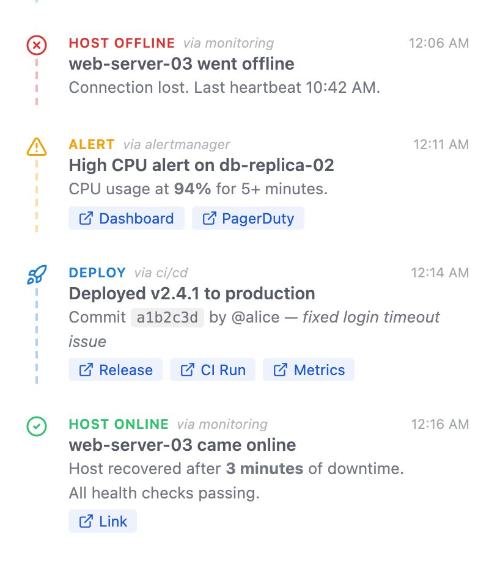
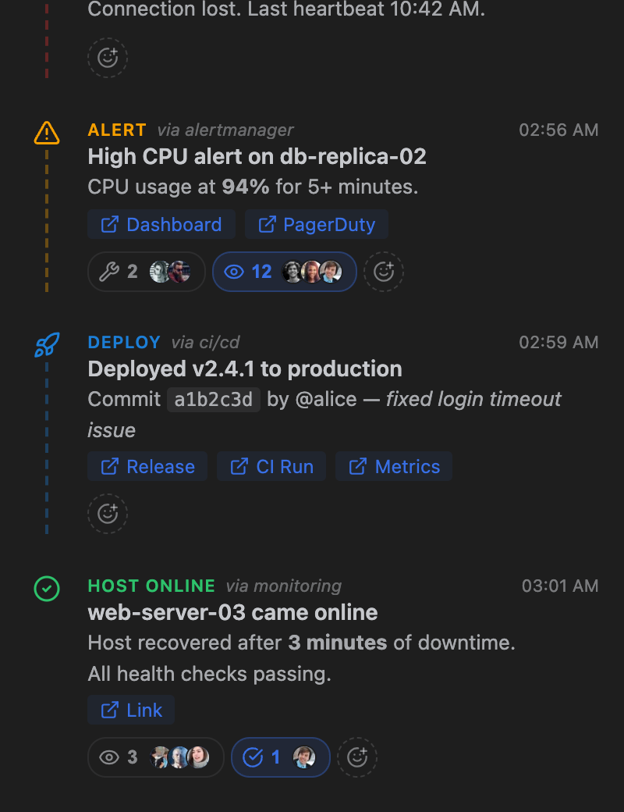
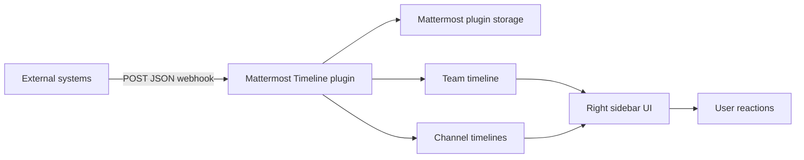

# Mattermost Timeline

**Webhook-powered event timeline for Mattermost**

[](https://github.com/icoretech/mattermost-timeline/actions/workflows/ci.yml)
[](https://github.com/icoretech/mattermost-timeline/actions/workflows/release.yml)
[](https://github.com/icoretech/mattermost-timeline/releases/latest)
[](https://github.com/icoretech/mattermost-timeline/stargazers)
[](https://mattermost.com/)
[](LICENSE)

Send deploys, alerts, incidents, security events, billing updates, and any other operational signal into a clean Mattermost sidebar timeline.

Instead of scattering machine updates across noisy chat channels, Mattermost Timeline gives every team a live event feed with icons, Markdown, useful links, channel targeting, idempotent updates, and lightweight reactions.

<p align="center">
  
  &nbsp;&nbsp;
  
</p>

If this plugin saves you dashboard-hopping, [star the repo](https://github.com/icoretech/mattermost-timeline) so other Mattermost teams can find it.

## Why teams use it

- **One place for operational context** — show deploys, alerts, incidents, payments, security events, and custom automation in the Mattermost right sidebar
- **Less channel noise** — keep machine-generated updates out of the message stream while still making them visible to the team
- **Team-wide or channel-specific timelines** — post an event to the whole team, or target one or more channels by name or ID
- **Update events instead of duplicating them** — send the same `external_id` to turn "deploy started" into "deploy finished" or "incident open" into "incident resolved"
- **Unread activity at a glance** — the channel-header Timeline icon shows a red dot when unseen timeline events arrive while the sidebar is closed
- **Fast triage links** — attach dashboards, CI runs, status pages, invoices, logs, or runbooks directly to each timeline item
- **Low-friction acknowledgement** — users can react with icons such as eyes, wrench, check, megaphone, thumbs-up, party, and heart without creating extra threads
- **Self-hosted Mattermost plugin** — no external timeline service; events are stored in Mattermost plugin storage

## Quick start

### 1. Install the plugin

Requirements: **Mattermost Server 7.0+**

1. Download the latest plugin bundle from [Releases](https://github.com/icoretech/mattermost-timeline/releases/latest)
2. In Mattermost, open **System Console → Plugin Management → Upload Plugin**
3. Upload `ch.icorete.mattermost-timeline-<version>.tar.gz`
4. Enable **Mattermost Timeline**
5. Open **System Console → Plugins → Mattermost Timeline** and set a **Webhook Secret**

### 2. Send your first event

```bash
export MATTERMOST_URL="https://mattermost.example.com"
export TIMELINE_SECRET="replace-with-your-webhook-secret"

curl -X POST "$MATTERMOST_URL/plugins/ch.icorete.mattermost-timeline/webhook?team_id=example-team" \
  -H "Content-Type: application/json" \
  -H "X-Webhook-Secret: $TIMELINE_SECRET" \
  -d '{
    "title": "Production deploy completed",
    "message": "Version `v2.4.1` is live. All smoke tests passed.",
    "event_type": "deploy",
    "source": "ci/cd",
    "external_id": "deploy-v2.4.1",
    "links": [
      {"label": "Release", "url": "https://example.com/releases/v2.4.1"},
      {"label": "CI run", "url": "https://example.com/ci/runs/123"}
    ]
  }'
```

Open Mattermost and click the Timeline icon in the right sidebar. The event appears immediately for users in that team.

## Common use cases

| Use case                    | Example source                                | Timeline value                                                       |
| --------------------------- | --------------------------------------------- | -------------------------------------------------------------------- |
| Deploy visibility           | GitHub Actions, Drone, Woodpecker, Jenkins    | See what changed, when, and where to inspect the run                 |
| Incident response           | Alertmanager, Opsgenie, PagerDuty, Statuspage | Keep incident state visible without flooding a channel               |
| Security awareness          | Auth0, SSO logs, audit pipelines              | Surface blocked logins, suspicious activity, and access changes      |
| Billing and business events | Stripe, ERP, internal apps                    | Share payment, invoice, and customer lifecycle updates               |
| Infrastructure changes      | Terraform, Ansible, Kubernetes automation     | Record host, service, and scheduled maintenance events               |
| AI and automation workflows | Claude Code hooks, internal agents, scripts   | Let agents leave structured status updates where humans already work |

## Channel-scoped events

By default, events are team-wide. Add `channels` to show an event only in specific channels.

```bash
curl -X POST "$MATTERMOST_URL/plugins/ch.icorete.mattermost-timeline/webhook?team_id=example-team" \
  -H "Content-Type: application/json" \
  -H "X-Webhook-Secret: $TIMELINE_SECRET" \
  -d '{
    "title": "High CPU on api-01",
    "message": "CPU has been above 90% for 10 minutes.",
    "event_type": "alert",
    "source": "alertmanager",
    "channels": ["platform-alerts"],
    "links": [
      {"label": "Dashboard", "url": "https://grafana.example.com/d/api"},
      {"label": "Runbook", "url": "https://runbooks.example.com/high-cpu"}
    ]
  }'
```

`channels` accepts channel names or channel IDs. Direct and group message channels are intentionally not supported.

## Updating an existing event

Use `external_id` when an external system has a stable event ID. A later webhook with the same `external_id` updates the existing timeline item instead of creating a duplicate.

```json
{
    "title": "Incident resolved: API latency spike",
    "message": "Resolved after rolling back the slow query change.",
    "event_type": "success",
    "source": "opsgenie",
    "external_id": "incident-2026-06-27-api-latency",
    "links": [
        {
            "label": "Postmortem",
            "url": "https://example.com/postmortems/api-latency"
        }
    ]
}
```

Existing links are preserved and new links are added once per URL, so the timeline keeps useful context as the event evolves.

## How it works



1. An external system sends a signed JSON webhook to the plugin
2. The plugin validates the shared secret, team, and optional channel targets
3. The event is stored and indexed by team and channel
4. Mattermost clients receive a live update and render the event in the right sidebar
5. Users can acknowledge or coordinate with reactions without adding chat noise

## Webhook reference

### Endpoint

```text
POST /plugins/ch.icorete.mattermost-timeline/webhook?team_id=<team-id-or-name>
```

### Required header

```text
X-Webhook-Secret: <configured-webhook-secret>
```

### Payload fields

| Field         | Type   | Required | Description                                                      |
| ------------- | ------ | -------- | ---------------------------------------------------------------- |
| `title`       | string | yes      | Timeline event title                                             |
| `message`     | string | no       | Event body; Markdown is supported                                |
| `event_type`  | string | no       | Icon/category hint; defaults to `generic`                        |
| `source`      | string | no       | Short source label, such as `ci/cd`, `alertmanager`, or `stripe` |
| `external_id` | string | no       | Idempotency key for updating an existing event                   |
| `links`       | array  | no       | Labeled links: `{ "label": "Dashboard", "url": "https://..." }`  |
| `link`        | string | no       | Legacy single-link field; prefer `links`                         |
| `team_id`     | string | no       | Team ID or team name; can also be passed as `?team_id=`          |
| `channels`    | array  | no       | Channel names or IDs; omit for team-wide events                  |

Supported event types: `host_online`, `host_offline`, `deploy`, `alert`, `error`, `info`, `success`, `money_in`, `money_out`, `security`, `incident`, `user_joined`, `user_left`, `scheduled`, `review`, `message`, and `generic`.

## Configuration

Configure the plugin from **System Console → Plugins → Mattermost Timeline**.

| Setting                  | Default      | What it controls                                                       |
| ------------------------ | ------------ | ---------------------------------------------------------------------- |
| Webhook Secret           | empty        | Shared secret required in the `X-Webhook-Secret` header                |
| Maximum Events Stored    | `500`        | How many events are persisted per team before older entries are pruned |
| Maximum Events Displayed | `100`        | How many events the sidebar loads at once                              |
| Timeline Order           | Oldest first | Whether newest events appear at the bottom or top                      |
| Enable Reactions         | `true`       | Whether users can react to timeline events                             |

## Verify a release signature

Release bundles include detached GPG signatures.

```bash
curl -sL https://raw.githubusercontent.com/icoretech/mattermost-timeline/main/assets/signing-key.asc | gpg --import
gpg --verify ch.icorete.mattermost-timeline-*.tar.gz.sig ch.icorete.mattermost-timeline-*.tar.gz
```

To let Mattermost verify signed plugin releases automatically, add the public key to your server:

```bash
mmctl plugin add key assets/signing-key.asc
```

## Build from source

Requirements for development:

- Go 1.26+
- Node.js 24+
- npm
- Make

```bash
git clone https://github.com/icoretech/mattermost-timeline.git
cd mattermost-timeline
make dist
```

The plugin bundle is written to `dist/ch.icorete.mattermost-timeline-<version>.tar.gz`.

Useful development commands:

```bash
make test                 # Go and webapp tests
make check-style          # manifest check, frontend lint/typecheck, go vet, golangci-lint
cd server && go test ./...
cd webapp && npm run test
cd webapp && npm run lint
```

To deploy a locally built bundle to a Mattermost development server with plugin uploads enabled:

```bash
export MM_SERVICESETTINGS_SITEURL="https://mattermost.example.com"
export MM_ADMIN_TOKEN="replace-with-personal-access-token"
make deploy
```

`MM_ADMIN_TOKEN` must be the token value shown when the Mattermost personal access token is created.

## What this is not

Mattermost Timeline is not a monitoring system, incident manager, CI server, or audit database. Keep those systems as the source of truth. Use this plugin to make their most important events visible inside the Mattermost workspace where people already coordinate.

## Support

- **Bugs and feature requests:** [GitHub Issues](https://github.com/icoretech/mattermost-timeline/issues)
- **Releases:** [GitHub Releases](https://github.com/icoretech/mattermost-timeline/releases)
- **Security reports:** use [GitHub private vulnerability reporting](https://github.com/icoretech/mattermost-timeline/security/advisories/new) if enabled, or contact the maintainers through the support links above

## License

[MIT](LICENSE) — Copyright (c) 2026 iCoreTech, Inc.

## Star history

[](https://star-history.com/#icoretech/mattermost-timeline&Date)
