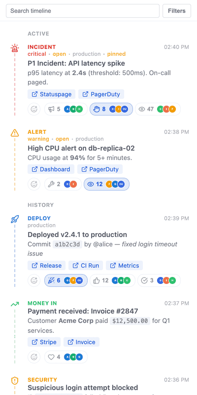
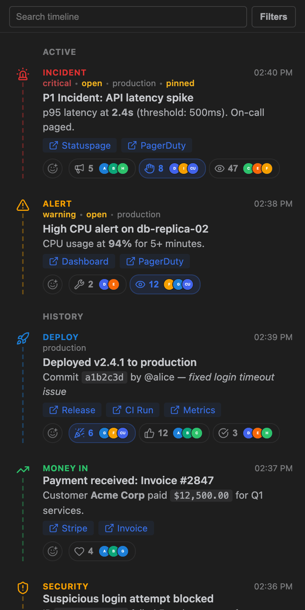
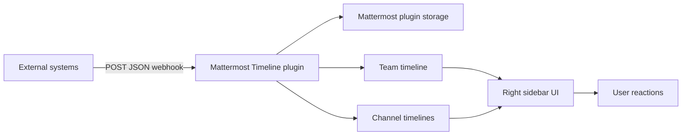

# Mattermost Timeline

**Webhook-powered event timeline for Mattermost**

[](https://github.com/icoretech/mattermost-timeline/actions/workflows/ci.yml)
[](https://github.com/icoretech/mattermost-timeline/actions/workflows/release.yml)
[](https://github.com/icoretech/mattermost-timeline/releases/latest)
[](https://github.com/icoretech/mattermost-timeline/stargazers)
[](https://mattermost.com/)
[](LICENSE)

Send deploys, alerts, incidents, security events, billing updates, and any other operational signal into a clean Mattermost sidebar timeline.

Instead of scattering machine updates across noisy chat channels, Mattermost Timeline gives every team a live event feed with icons, Markdown, useful links, channel targeting, idempotent updates, and lightweight reactions.

<p align="center">
  
  &nbsp;&nbsp;
  
</p>

If this plugin saves you dashboard-hopping, [star the repo](https://github.com/icoretech/mattermost-timeline) so other Mattermost teams can find it.

## Why teams use it

- **See operational state** — severity, status and environment make deploys, alerts and incidents easy to scan
- **Find the right events** — search the feed and combine type, source, environment, status, severity and unread filters
- **Keep ongoing work visible** — pinned events and open incidents appear in Active, separate from History
- **Connect integrations independently** — named tokens can restrict delivery to teams and channels and require signed requests
- **Keep chat focused** — publish to a team or selected channels without adding messages to conversations
- **Update instead of duplicate** — reuse `external_id` as a deploy progresses or an incident is resolved; send up to 50 events in a batch
- **Acknowledge what matters** — unread indicators and reactions help teams coordinate without extra threads

Events stay in Mattermost plugin storage. No external timeline service is required.

## Quick start

### 1. Install the plugin

Requirements: **Mattermost Server 7.0+**. The 2.0 release is smoke-tested on Mattermost 11.11.1.

1. Download the latest plugin bundle from [Releases](https://github.com/icoretech/mattermost-timeline/releases/latest)
2. In Mattermost, open **System Console → Plugin Management → Upload Plugin**
3. Upload `ch.icorete.mattermost-timeline-<version>.tar.gz`
4. Enable **Mattermost Timeline**
5. Open **System Console → Plugins → Mattermost Timeline**, select **Add token**, enter a name and secret, then select **Save tokens**

### 2. Send your first event

```bash
export MATTERMOST_URL="https://mattermost.example.com"
export TIMELINE_SECRET="replace-with-your-token-secret"

curl -X POST "$MATTERMOST_URL/plugins/ch.icorete.mattermost-timeline/webhook?team_id=example-team" \
  -H "Content-Type: application/json" \
  -H "X-Webhook-Secret: $TIMELINE_SECRET" \
  -d '{
    "title": "Production deploy completed",
    "message": "Version `v2.4.1` is live. All smoke tests passed.",
    "event_type": "deploy",
    "severity": "info",
    "status": "success",
    "environment": "production",
    "source": "ci/cd",
    "external_id": "deploy-v2.4.1",
    "links": [
      {"label": "Release", "url": "https://example.com/releases/v2.4.1"},
      {"label": "CI run", "url": "https://example.com/ci/runs/123"}
    ]
  }'
```

Open Mattermost and click the Timeline icon in the right sidebar. The event appears immediately for users in that team.

## Common use cases

| Use case                    | Example source                                | Timeline value                                                       |
| --------------------------- | --------------------------------------------- | -------------------------------------------------------------------- |
| Deploy visibility           | GitHub Actions, Drone, Woodpecker, Jenkins    | See what changed, when, and where to inspect the run                 |
| Incident response           | Alertmanager, Opsgenie, PagerDuty, Statuspage | Keep incident state visible without flooding a channel               |
| Security awareness          | Auth0, SSO logs, audit pipelines              | Surface blocked logins, suspicious activity, and access changes      |
| Billing and business events | Stripe, ERP, internal apps                    | Share payment, invoice, and customer lifecycle updates               |
| Infrastructure changes      | Terraform, Ansible, Kubernetes automation     | Record host, service, and scheduled maintenance events               |
| AI and automation workflows | Claude Code hooks, internal agents, scripts   | Let agents leave structured status updates where humans already work |

## Find and triage events

Use **Search timeline** to search titles, messages, sources, external IDs, event types, environments and links. Open **Filters** to combine:

| Filter | Matches |
| --- | --- |
| Event type, source, environment | The exact value, ignoring letter case |
| Severity | `info`, `warning`, `critical` |
| Status | `open`, `running`, `success`, `failed`, `resolved`, `closed` |
| Pinned | Events whose sender set `pinned: true` |
| Active | Pinned events, or unexpired non-terminal events that are open, running or critical |
| Unread | Events not yet marked read in the current team/channel context |

Filtering happens before pagination, so matches can come from older events as well as the first page. Loading more keeps the selected filters. Filtered results refresh when webhook events are created or updated. Opening the feed marks the returned visible events read.

When the feed contains both active and historical events, **Active** appears before **History**. The configured timeline order applies within each group. `success`, `failed`, `resolved`, and `closed` are terminal statuses and appear in History, even at critical severity. A pinned event stays active even after expiry, resolution, or closure; its sender must unset `pinned` to move it to History. The Status filter matches each status separately, so `closed` does not include `resolved` events.

Your integration controls operational state through webhook fields. The sidebar displays those values; it does not provide an incident-management workflow. `expires_at` is presentation metadata, not a deletion timer: expired events remain searchable until normal retention removes them.

## Channel-scoped events

By default, events are team-wide. Add `channels` to show an event only in specific channels.

```bash
curl -X POST "$MATTERMOST_URL/plugins/ch.icorete.mattermost-timeline/webhook?team_id=example-team" \
  -H "Content-Type: application/json" \
  -H "X-Webhook-Secret: $TIMELINE_SECRET" \
  -d '{
    "title": "High CPU on api-01",
    "message": "CPU has been above 90% for 10 minutes.",
    "event_type": "alert",
    "source": "alertmanager",
    "channels": ["platform-alerts"],
    "links": [
      {"label": "Dashboard", "url": "https://grafana.example.com/d/api"},
      {"label": "Runbook", "url": "https://runbooks.example.com/high-cpu"}
    ]
  }'
```

`channels` accepts channel names or channel IDs. Direct and group message channels are intentionally not supported.

## Updating an existing event

Use `external_id` when an external system has a stable event ID. A later webhook with the same `external_id` updates the existing timeline item instead of creating a duplicate.

```json
{
    "title": "Incident resolved: API latency spike",
    "message": "Resolved after rolling back the slow query change.",
    "event_type": "success",
    "status": "resolved",
    "environment": "production",
    "source": "opsgenie",
    "external_id": "incident-2026-06-27-api-latency",
    "links": [
        {
            "label": "Postmortem",
            "url": "https://example.com/postmortems/api-latency"
        }
    ]
}
```

Existing links are preserved and new links are added once per URL. Omitted operational metadata is retained; explicit `false` or `0` values clear pinning and timestamps. Sending `status: ""` clears the status; omitting `status` retains its existing value. Setting `status` to `resolved` records `resolved_at` automatically unless a timestamp is supplied. Setting `status` to `closed` marks the same event closed without implying resolution or automatically recording `resolved_at`; existing resolution metadata is retained unless explicitly cleared with `resolved_at: 0`. Reuse the same `external_id` to update the event instead of creating another timeline item. A scoped token can only update an existing event when its current channels also fall within the token's permissions.

## How it works


```mermaid
graph LR
    A[External systems] -->|POST JSON webhook| B[Mattermost Timeline plugin]
    B --> C[Mattermost plugin storage]
    B --> D[Team timeline]
    B --> E[Channel timelines]
    D --> F[Right sidebar UI]
    E --> F
    F --> G[User reactions]
```

1. An external system sends JSON using a token secret or an HMAC signature
2. The plugin validates authentication, token scope, payload fields and channel targets
3. The event is stored and indexed by team and channel
4. Mattermost clients receive a live update and render the event in the right sidebar
5. Users can acknowledge or coordinate with reactions without adding chat noise

## Webhook reference

### Endpoint

```text
POST /plugins/ch.icorete.mattermost-timeline/webhook?team_id=<team-id-or-name>
```

### Authentication headers

Unsigned requests use the secret of a named token or the legacy shared secret:

```text
X-Webhook-Secret: <configured-webhook-secret>
```

Signed webhooks are also supported:

```text
X-Timeline-Timestamp: <unix-seconds>
X-Timeline-Signature: sha256=<hex-hmac>
```

### Payload fields

| Field         | Type    | Required | Description                                                               |
| ------------- | ------- | -------- | ------------------------------------------------------------------------- |
| `title`       | string  | yes      | Timeline event title                                                      |
| `message`     | string  | no       | Event body; Markdown is supported                                         |
| `event_type`  | string  | no       | Icon/category hint; defaults to `generic`                                 |
| `source`      | string  | no       | Short source label, such as `ci/cd`, `alertmanager`, or `stripe`          |
| `external_id` | string  | no       | Idempotency key for updating an existing event                            |
| `links`       | array   | no       | Labeled links: `{ "label": "Dashboard", "url": "https://..." }`     |
| `link`        | string  | no       | Legacy single-link field; prefer `links`                                  |
| `team_id`     | string  | no       | Team ID or team name; can also be passed as `?team_id=`                   |
| `channels`    | array   | no       | Channel names or IDs; omit for team-wide events                           |
| `severity`    | string  | no       | Triage severity: `info`, `warning`, or `critical`                         |
| `status`      | string  | no       | Triage status: `open`, `running`, `success`, `failed`, `resolved`, or `closed`; `""` clears it |
| `environment` | string  | no       | Short environment label, such as `production`, `staging`, or `test`       |
| `expires_at`  | integer | no       | Unix millisecond timestamp used as presentation metadata only             |
| `pinned`      | boolean | no       | Pin the event into the active group                                       |
| `resolved_at` | integer | no       | Unix millisecond timestamp marking resolution metadata                    |

Supported event types: `host_online`, `host_offline`, `deploy`, `alert`, `error`, `info`, `success`, `money_in`, `money_out`, `security`, `incident`, `user_joined`, `user_left`, `scheduled`, `review`, `message`, and `generic`. Custom event types are accepted and render with the generic fallback icon.

### Signed webhooks

For signed requests, compute an HMAC-SHA256 with the webhook credential secret:

```text
message = <timestamp>.<raw request body>
signature = hex(hmac_sha256(secret, message))
```

Send the Unix seconds timestamp in `X-Timeline-Timestamp` and the signature as `sha256=<hex>` in `X-Timeline-Signature`. Signatures are accepted inside a 5-minute replay window, and the same signature cannot be reused inside that window. Legacy `X-Webhook-Secret` remains supported unless **Require Signed Webhooks** is enabled or a token has `require_signature: true`.

### Multiple webhook tokens

Create a token for each integration under **Webhook Tokens**:

1. Enter a unique name and a secret. New or renamed tokens need a secret before they can be enabled; leave an existing token's secret blank to keep it
2. Optionally limit the token to a team and channels by name or ID. A channel-restricted token cannot publish team-wide events; include allowed channels in the webhook payload
3. Enable **Require signed requests** if the sender supports HMAC signatures
4. Select **Save tokens**. The page's **Save** button applies the other settings

The plugin stores token settings in this format:

```json
[
    {
        "name": "github-actions",
        "secret": "replace-with-a-long-random-secret",
        "enabled": true,
        "team": "example-org",
        "channels": ["town-square"],
        "require_signature": true
    }
]
```

When a named token authenticates a payload without `source`, the token name becomes the event source.

### Batch webhook

```text
POST /plugins/ch.icorete.mattermost-timeline/webhook/batch?team_id=<team-id-or-name>
```

Batch requests accept either an array of events:

```json
[{"title":"Deploy completed","event_type":"deploy"}]
```

or an object with an `events` array:

```json
{"events":[{"title":"Deploy completed","event_type":"deploy"}]}
```

Each batch accepts up to 50 events and a 1 MiB request body. A valid batch returns a result for every item: successful entries are stored even if another entry fails validation. HTTP `200` means all items succeeded; HTTP `207` means at least one item failed. Malformed JSON or an invalid batch shape rejects the request as a whole.

The published [event schema](schema/timeline-event.schema.json) and [batch schema](schema/timeline-batch.schema.json) describe the payloads. Server-side authorization and link protocol checks still apply. A single-event request is limited to 256 KiB; titles to 200 characters, messages to 8,000 characters, links to 10 and channels to 10. URLs may be relative or use HTTP, HTTPS, mailto or tel, and must not contain control characters.

## Integration recipes

### Generic signed curl

```bash
export MATTERMOST_URL="https://mattermost.example.com"
export TIMELINE_SECRET="replace-with-a-long-random-secret"
body='{"title":"Signed timeline event","severity":"info","status":"open"}'
timestamp="$(date +%s)"
signature="$(printf '%s.%s' "$timestamp" "$body" | python3 -c 'import hashlib,hmac,os,sys; print(hmac.new(os.environ["TIMELINE_SECRET"].encode(), sys.stdin.buffer.read(), hashlib.sha256).hexdigest())')"

curl -X POST "$MATTERMOST_URL/plugins/ch.icorete.mattermost-timeline/webhook?team_id=example-org" \
  -H "Content-Type: application/json" \
  -H "X-Timeline-Timestamp: $timestamp" \
  -H "X-Timeline-Signature: sha256=$signature" \
  -d "$body"
```

### GitHub Actions

```yaml
- name: Post timeline event
  env:
    MATTERMOST_URL: https://mattermost.example.com
    TIMELINE_SECRET: ${{ secrets.TIMELINE_SECRET }}
  run: |
    body='{"title":"GitHub Actions deploy completed","event_type":"deploy","source":"github-actions","links":[{"label":"Run","url":"https://github.com/example-org/example-repo/actions"}]}'
    timestamp="$(date +%s)"
    signature="$(printf '%s.%s' "$timestamp" "$body" | python3 -c 'import hashlib,hmac,os,sys; print(hmac.new(os.environ["TIMELINE_SECRET"].encode(), sys.stdin.buffer.read(), hashlib.sha256).hexdigest())')"
    curl -fsS -X POST "$MATTERMOST_URL/plugins/ch.icorete.mattermost-timeline/webhook?team_id=example-org" \
      -H "Content-Type: application/json" \
      -H "X-Timeline-Timestamp: $timestamp" \
      -H "X-Timeline-Signature: sha256=$signature" \
      -d "$body"
```

### Drone or Woodpecker

```bash
body='{"title":"Pipeline finished","event_type":"deploy","source":"ci","status":"success","environment":"production"}'
timestamp="$(date +%s)"
signature="$(printf '%s.%s' "$timestamp" "$body" | python3 -c 'import hashlib,hmac,os,sys; print(hmac.new(os.environ["TIMELINE_SECRET"].encode(), sys.stdin.buffer.read(), hashlib.sha256).hexdigest())')"
curl -fsS -X POST "https://mattermost.example.com/plugins/ch.icorete.mattermost-timeline/webhook?team_id=example-org" \
  -H "Content-Type: application/json" \
  -H "X-Timeline-Timestamp: $timestamp" \
  -H "X-Timeline-Signature: sha256=$signature" \
  -d "$body"
```

### Alertmanager-style event

```json
{
    "title": "API latency alert",
    "message": "p95 latency is above threshold for 10 minutes.",
    "event_type": "alert",
    "source": "alertmanager",
    "severity": "critical",
    "status": "open",
    "external_id": "alert-api-latency",
    "links": [
        {
            "label": "Dashboard",
            "url": "https://grafana.example.com/d/api"
        }
    ]
}
```

## Configuration

Configure the plugin from **System Console → Plugins → Mattermost Timeline**.

| Setting                  | Default      | What it controls                                                       |
| ------------------------ | ------------ | ---------------------------------------------------------------------- |
| Webhook Tokens           | `[]`         | Named tokens managed in the admin editor, with optional team/channel limits and signatures |
| Require Signed Webhooks  | `false`      | Require HMAC signatures for all tokens and the legacy shared secret |
| Webhook Secret (legacy)  | empty        | Shared secret for existing integrations; no team/channel restrictions |
| Webhook URLs & Test      | —            | Copy webhook URLs and create a test event in a team or channel |
| Maximum Events Stored    | `500`        | How many events are persisted per team before older entries are pruned |
| Maximum Events Displayed | `100`        | Maximum events loaded per request; older events remain available through pagination |
| Timeline Order           | Oldest first | Whether newest events appear at the bottom or top                      |
| Enable Reactions         | `true`       | Whether users can react to timeline events                             |

The admin test creates an event directly. It checks timeline delivery but does not verify a webhook token or signature; use the signed webhook recipe above to test authentication.

`expires_at`, `status`, and `resolved_at` are presentation and triage metadata. They do not turn Timeline into an incident-management system, and expired events remain searchable until normal retention prunes them.

## Upgrading from 1.x to 2.0

Existing events, reactions, unread state and `external_id` mappings remain in place. The existing shared secret still works under **Webhook Secret (legacy)**; signing remains opt-in unless you enable **Require Signed Webhooks** or require it on an individual token.

For new integrations, create separate tokens. To migrate an existing sender, create a token, update the sender to use its secret, verify delivery, then retire the shared secret when all senders have migrated. A token secret must differ from other enabled token secrets and the legacy secret.

Version 2.0 validates payload lengths, metadata values and link protocols. Integrations sending invalid or oversized fields should handle HTTP `400`/`413` responses and correct their payloads. For signed requests, retry with a fresh timestamp and signature: reusing a signature returns HTTP `409`. For batches, check each item result before retrying failed entries.

Token changes use **Save tokens**. Other plugin settings use the page's **Save** button. The admin test creates an event directly and does not validate the sender's credentials or signature.

## Verify a release signature

Release bundles include detached GPG signatures.

```bash
curl -sL https://raw.githubusercontent.com/icoretech/mattermost-timeline/main/assets/signing-key.asc | gpg --import
gpg --verify ch.icorete.mattermost-timeline-*.tar.gz.sig ch.icorete.mattermost-timeline-*.tar.gz
```

To let Mattermost verify signed plugin releases automatically, add the public key to your server:

```bash
mmctl plugin add key assets/signing-key.asc
```

## Build from source

Requirements for development:

- Go 1.27.1+
- Node.js 24.15+ (CI uses 24.21.0)
- npm
- Make

```bash
git clone https://github.com/icoretech/mattermost-timeline.git
cd mattermost-timeline
make dist
```

The plugin bundle is written to `dist/ch.icorete.mattermost-timeline-<version>.tar.gz`.

Useful development commands:

```bash
make test                 # Go and webapp tests
make check-style          # manifest check, frontend lint/typecheck, go vet, golangci-lint
cd server && go test ./...
cd webapp && npm run test
cd webapp && npm run lint
```

To deploy a locally built bundle to a Mattermost development server with plugin uploads enabled:

```bash
export MM_SERVICESETTINGS_SITEURL="https://mattermost.example.com"
export MM_ADMIN_TOKEN="replace-with-personal-access-token"
make deploy
```

`MM_ADMIN_TOKEN` must be the token value shown when the Mattermost personal access token is created.

## What this is not

Mattermost Timeline is not a monitoring system, incident manager, CI server, or audit database. Keep those systems as the source of truth. Use this plugin to make their most important events visible inside the Mattermost workspace where people already coordinate.

## Support

- **Bugs and feature requests:** [GitHub Issues](https://github.com/icoretech/mattermost-timeline/issues)
- **Releases:** [GitHub Releases](https://github.com/icoretech/mattermost-timeline/releases)
- **Security reports:** use [GitHub private vulnerability reporting](https://github.com/icoretech/mattermost-timeline/security/advisories/new) if enabled, or contact the maintainers through the support links above

## License

[MIT](LICENSE) — Copyright (c) 2026 iCoreTech, Inc.

## Star history

[](https://star-history.com/#icoretech/mattermost-timeline&Date)
